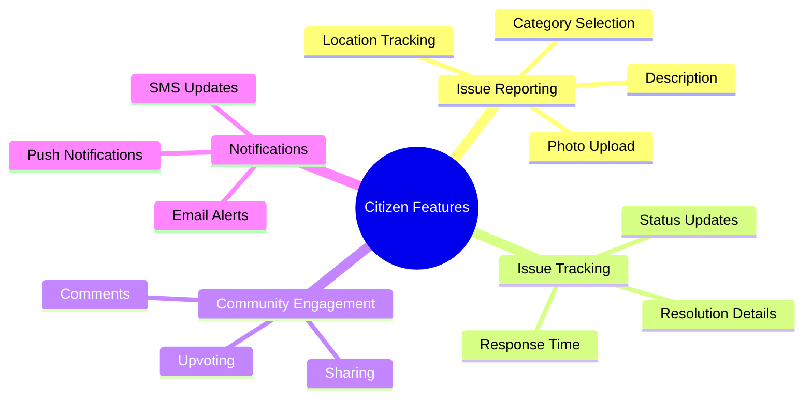
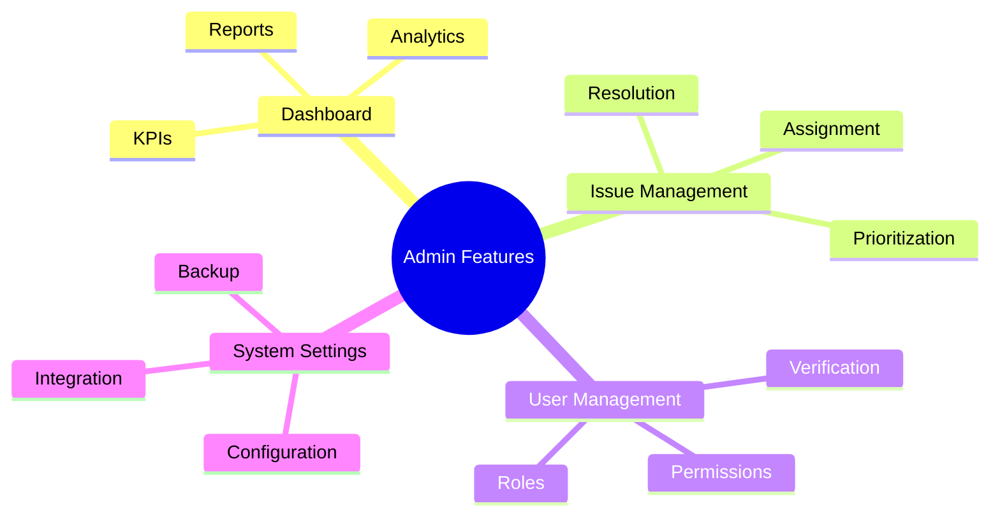
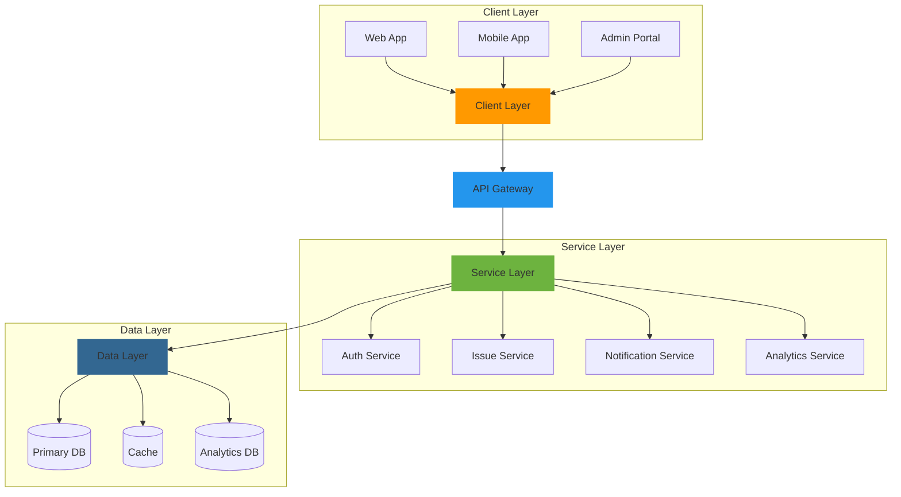
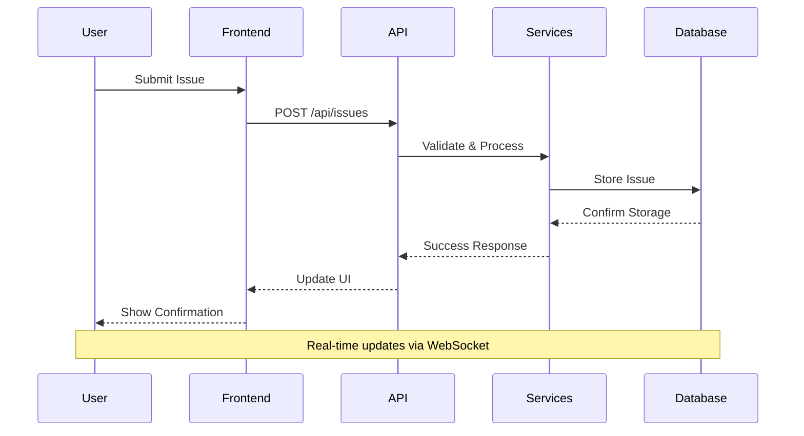
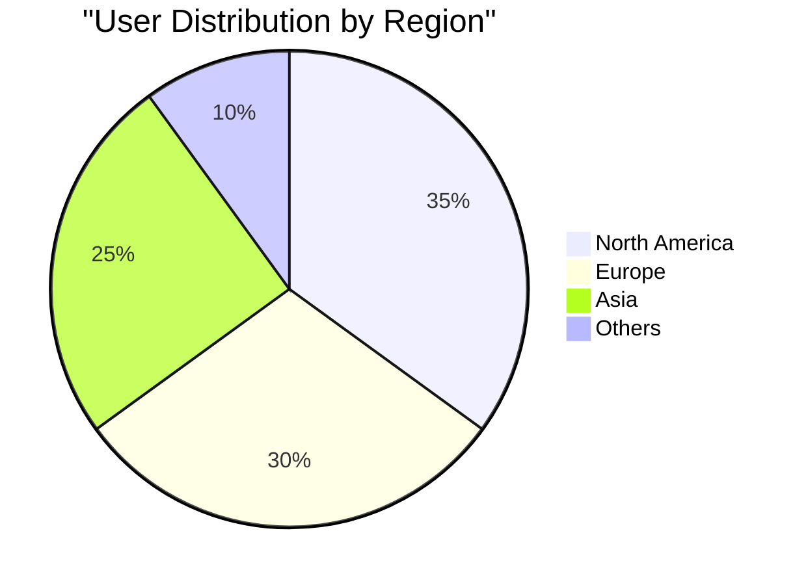
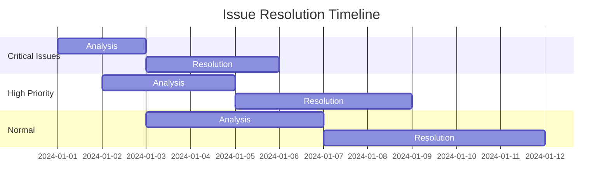
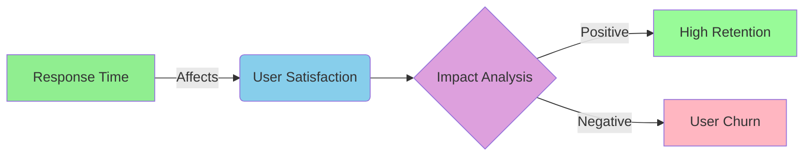
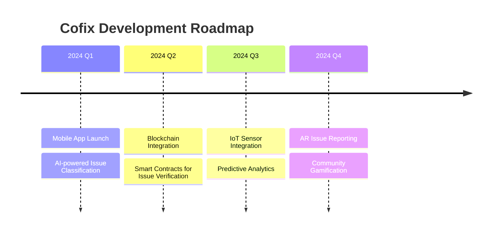
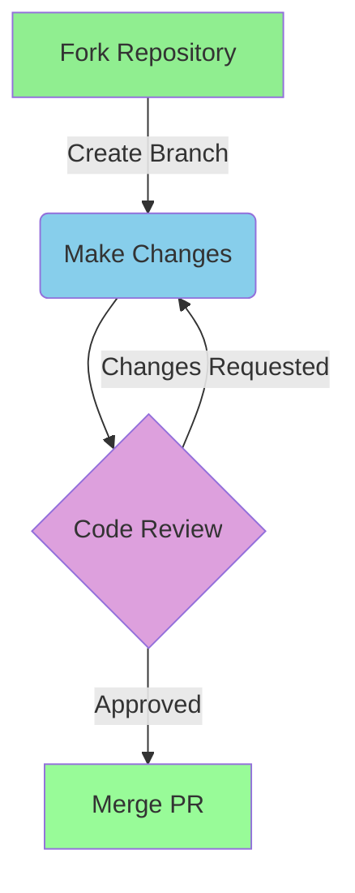

<div align="center">

# 🌟 Cofix v3.0 - Smart Community Issue Management Platform

[](https://github.com/cofix)
[](https://cofix.docs.io)
[](https://opensource.org/licenses/MIT)
[](https://twitter.com/cofixapp)
[](https://github.com/prettier/prettier)
[](http://makeapullrequest.com)

<p align="center">
  
</p>

### 🚀 Empowering Communities Through Smart Technology

[Live Demo](https://demo.cofix.io) • [Documentation](https://docs.cofix.io) • [Report Bug](https://github.com/cofix/issues) • [Request Feature](https://github.com/cofix/issues)

</div>

---

## 📚 Table of Contents

<details>
<summary>Click to expand</summary>

- [About](#-about)
- [Features](#-key-features)
- [System Architecture](#-system-architecture)
- [Technology Stack](#-technology-stack)
- [Installation](#-installation)
- [Usage](#-usage)
- [API Documentation](#-api-documentation)
- [Analytics & Reports](#-analytics--reports)
- [Contributing](#-contributing)
- [Roadmap](#-roadmap)
- [Support](#-support)
- [License](#-license)
</details>

## 🎯 About

<table>
<tr>
<td>

Cofix is a next-generation community issue reporting and tracking platform that revolutionizes how citizens interact with local authorities. By leveraging cutting-edge technology and user-centric design, we're creating stronger, more responsive communities.

### 🌈 Vision
To create interconnected, responsive communities where every voice matters and every issue finds resolution.

### 🎖️ Recognition
- 🏆 "Best Civic Tech Solution 2024" - Tech Innovation Awards
- 🌟 Featured in Government Technology Magazine
- 💫 100,000+ Active Users Worldwide

</td>
<td>

<div align="center">

<p><em>Cofix Dashboard Interface</em></p>
</div>

</td>
</tr>
</table>

## ✨ Key Features

### 👥 For Citizens



### 👨‍💼 For Administrators



## 🏗️ System Architecture

### High-Level Overview



### Data Flow



## 🛠️ Technology Stack

<div align="center">

### Frontend


### Backend


### Database


### DevOps


</div>

## 📦 Installation

### Prerequisites

```bash
Node.js >= 14
Java JDK >= 11
Docker >= 20.10
Kubernetes >= 1.20
```

### Development Setup

<details>
<summary>1. Clone & Configure</summary>

```bash
# Clone the repository
git clone https://github.com/cofix/cofix.git

# Navigate to project directory
cd cofix

# Install dependencies
npm install

# Configure environment
cp .env.example .env
```
</details>

<details>
<summary>2. Database Setup</summary>

```bash
# Start PostgreSQL container
docker-compose up -d postgres

# Run migrations
npm run migrate

# Seed database
npm run seed
```
</details>

<details>
<summary>3. Start Development Servers</summary>

```bash
# Start frontend
npm run dev

# Start backend
cd backend && ./mvnw spring-boot:run
```
</details>

## 📊 Analytics & Reports

### User Growth



### Issue Resolution Metrics



### Performance Dashboard



## 💻 API Documentation

### Authentication
```javascript
// Login
POST /api/auth/login
{
  "email": "user@example.com",
  "password": "securepassword"
}

// Register
POST /api/auth/register
{
  "name": "John Doe",
  "email": "john@example.com",
  "password": "securepassword"
}
```

### Issue Management
```javascript
// Create Issue
POST /api/issues
{
  "title": "Street Light Malfunction",
  "description": "Light pole #123 not working",
  "location": {
    "lat": 40.7128,
    "lng": -74.0060
  },
  "category": "INFRASTRUCTURE"
}

// Get Issues
GET /api/issues?status=OPEN&priority=HIGH
```

## 🛣️ Roadmap



## 🤝 Contributing

We welcome contributions! Please see our [Contributing Guide](CONTRIBUTING.md) for details.



## 🌈 Community Stats

<div align="center">


</div>

## 📫 Support

<div align="center">

[](https://discord.gg/cofix)
[](https://stackoverflow.com/questions/tagged/cofix)
[](https://reddit.com/r/cofix)

</div>

## 📄 License

This project is licensed under the MIT License - see the [LICENSE](LICENSE) file for details.

---

<div align="center">

### 🌟 Star us on GitHub — it motivates us a lot! 

Made with ❤️ by the Cofix Team

[Website](https://cofix.io) • [Blog](https://blog.cofix.io) • [Twitter](https://twitter.com/cofixapp)

</div>